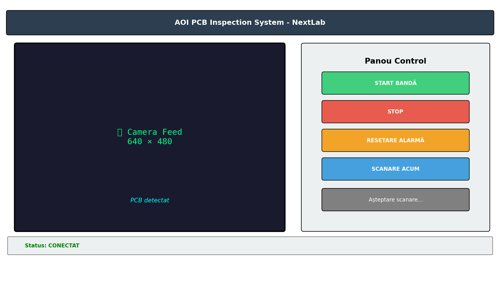

# Etapa 4 – Arhitectura Sistemului Inteligent de Automatizare (SIA)

> **Student:** Leonard Popescu • FIIR–SIA–II, 631AB

## 4.1 Arhitectura Generală

Sistemul AOI (Automated Optical Inspection) pentru PCB-uri este compus din 3 module principale:

```
┌─────────────────────────────────────────────────────────────┐
│                    SISTEM AOI PCB                           │
├──────────────┬──────────────────┬───────────────────────────┤
│   MODUL 1    │     MODUL 2     │         MODUL 3           │
│  Achiziție   │  Rețea Neurală  │      Aplicație UI         │
│    Date      │    YOLOv11      │   (Tkinter + OpenCV)      │
├──────────────┼──────────────────┼───────────────────────────┤
│ • Cameră USB │ • model.py      │ • main.py (GUI)           │
│ • DroidCam   │ • train.py      │ • Feed video live         │
│ • Generator  │ • evaluate.py   │ • Control bandă           │
│   date       │ • optimize.py   │ • Alarmă defecte          │
│ • Arduino    │ • visualize.py  │ • Comunicare serială      │
│   Serial     │                 │                           │
└──────────────┴──────────────────┴───────────────────────────┘
```

## 4.2 Diagrama State Machine

Sistemul funcționează ca o mașină de stări cu următoarele stări principale:

```
[IDLE] ──START──▶ [CONVEYOR_RUNNING]
                       │
                  PCB detectat
                       │
                       ▼
               [SCANNING_AI]
                  │         │
            OK ──┘         └── DEFECT
            │                    │
            ▼                    ▼
    [CONVEYOR_RUNNING]    [ALARM_ACTIVE]
                               │
                          RESET ALARMĂ
                               │
                               ▼
                         [IDLE]
```

Vezi diagrama detaliată: `docs/state_machine.png`

## 4.3 Modul 1 – Achiziție Date (`src/data_acquisition/`)

### Componente Hardware
- **Camera**: USB sau DroidCam (WiFi), index configurabil
- **Arduino**: Placa NextLabTech A1 (ATmega328PB)
  - Senzor HC-SR04 (detectare obstacol)
  - Servo GoBilda (control motor bandă)
- **Conexiune**: Serial COM (9600 baud)

### Fluxul de Date
1. Camera captează frame-uri la ~30 FPS
2. Fiecare frame este redimensionat la 640×480 (display)
3. Detecția PCB se face prin analiza edge-urilor (Canny)
4. Când PCB e detectat → se trimite la AI pentru inferență

## 4.4 Modul 2 – Rețea Neuronală (`src/neural_network/`)

### Arhitectură YOLOv11n
- **Tip**: Single-Shot Detector (real-time)
- **Backbone**: CSP-Darknet (nano variant)
- **Neck**: PANet (Path Aggregation Network)
- **Head**: Decoupled head cu 3 ieșiri (box, cls, dfl)
- **Input**: 640×640×3
- **Output**: Bounding boxes + 6 clase + confidence

### Justificare Alegere
- **Viteză**: ~10ms inferență pe GPU → potrivit pentru timp real
- **Dimensiune**: ~2.6M parametri (nano) → deployment pe edge
- **Acuratețe**: mAP@50 > 0.98 pe dataset-ul PCB

## 4.5 Modul 3 – Aplicație UI (`src/app/`)

### Interfața Grafică (Tkinter)
- **Panel video**: Feed cameră live 640×480
- **Panou control**: Butoane Start/Stop/Reset/Scan
- **Selector cameră**: RadioButtons (0-3)
- **Jurnal inspecție**: Text log cu timestamp
- **Status bar**: Stare conexiune + rezultat scanare

### Comunicare Inter-Module
```
Camera → Frame BGR → AI Inference → Detecții → GUI Display
                                        │
                                   Defect? ──YES──▶ Serial → Arduino → STOP motor
                                        │
                                       NO ──▶ Continue conveyor
```

## 4.6 Firmware Arduino (`firmware/aoi_system.ino`)

### Comenzi Serial
| Comandă | Acțiune | Răspuns |
|---------|---------|---------|
| `S` | Start motor | `ACK:STARTING` |
| `O` | Stop motor | `ACK:STOPPED` |

### Feedback Senzor
| Mesaj | Semnificație |
|-------|-------------|
| `OBSTACOL` | PCB detectat (< 6cm) |
| `CLEAR` | Bandă liberă (> 10cm) |
| `SYSTEM_READY` | Arduino pornit |

## 4.7 Screenshot UI Schelet



*Nota: Screenshot-ul prezintă interfața aplicației cu panoul de control și feed-ul video.*
