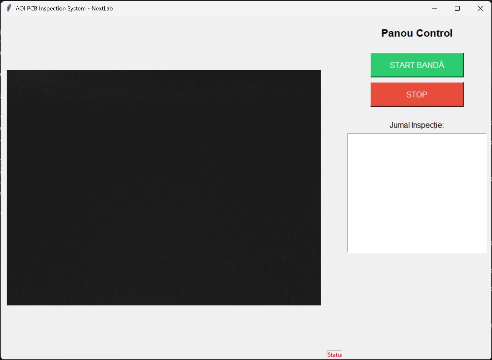

# Etapa 5 – Antrenare Model

> **Student:** Leonard Popescu • FIIR–SIA–II, 631AB

## 5.1 Configurare Antrenare

### Model de Bază
- **Arhitectură**: YOLOv11n (nano)
- **Pretraining**: COCO dataset
- **Fine-tuning**: PCB Defects dataset (6 clase)

### Hiperparametri

| Parametru | Valoare |
|-----------|---------|
| Epoci maxime | 100 |
| Early stopping (patience) | 25 |
| Batch size | 16 |
| Image size | 640×640 |
| Optimizer | AdamW (auto) |
| Learning rate inițial | 0.01 |
| Learning rate final | 0.01 |
| Momentum | 0.937 |
| Weight decay | 0.0005 |
| Warmup epochs | 3.0 |
| AMP (mixed precision) | Da |

### Augmentări
| Augmentare | Valoare |
|------------|---------|
| HSV Hue | 0.015 |
| HSV Saturation | 0.7 |
| HSV Value | 0.4 |
| Flip LR | 0.5 |
| Mosaic | 1.0 |
| Scale | 0.5 |
| Translate | 0.1 |
| Erasing | 0.4 |

## 5.2 Procesul de Antrenare

Antrenarea a rulat pe Google Colab cu GPU NVIDIA T4/A100.

### Evoluția Loss-ului

| Epoca | Box Loss (Train) | Cls Loss (Train) | Box Loss (Val) | Cls Loss (Val) |
|-------|-------------------|-------------------|-----------------|-----------------|
| 1 | 2.442 | 4.534 | 1.962 | 1.883 |
| 10 | 1.836 | 1.051 | 1.713 | 0.873 |
| 20 | 1.749 | 0.900 | 1.723 | 0.764 |
| 30 | 1.688 | 0.827 | 1.609 | 0.675 |
| 40 | 1.629 | 0.783 | 1.567 | 0.649 |
| 50 | 1.584 | 0.741 | 1.541 | 0.616 |
| **52** | **1.577** | **0.741** | **1.524** | **0.615** |

Antrenarea s-a oprit la **epoca 52** prin early stopping (patience=25, best la epoca 52).

### Grafice
- Loss curves: `docs/results/loss_curve.png`
- Metrici evolution: `docs/results/metrics_evolution.png`

## 5.3 Metrici pe Validation Set (Best – Epoca 52)

| Metrică | Valoare |
|---------|---------|
| **Precision** | 0.9765 |
| **Recall** | 0.9812 |
| **mAP@50** | 0.9859 |
| **mAP@50-95** | 0.5629 |

### Interpretare
- **Precision 97.65%**: Din toate detecțiile pozitive, 97.65% sunt corecte
- **Recall 98.12%**: Modelul identifică 98.12% din defectele reale
- **mAP@50 98.59%**: Performanță excelentă la IoU threshold 0.5
- **mAP@50-95 56.29%**: Performanță moderată la threshold-uri stricte (localizare precisă)

## 5.4 Metrici pe Test Set

Metrici salvate în `results/test_metrics.json`:

```json
{
    "epoch": 52,
    "precision": 0.97654,
    "recall": 0.98117,
    "map50": 0.98588,
    "map50-95": 0.56289,
    "val_box_loss": 1.52447,
    "val_cls_loss": 0.61514
}
```

## 5.5 Observații

1. **Convergență rapidă**: Modelul atinge performanțe bune încă de la epoca 10 (mAP@50 > 0.95)
2. **Fără overfitting semnificativ**: Gap-ul train/val loss rămâne mic
3. **Precision-Recall echilibrat**: Ambele > 0.97, fără trade-off semnificativ
4. **mAP@50-95 moderat**: Localizarea foarte precisă poate fi îmbunătățită

## 5.6 Screenshot Inferență



*Inferență pe imagine PCB reală cu modelul antrenat la epoca 52.*
