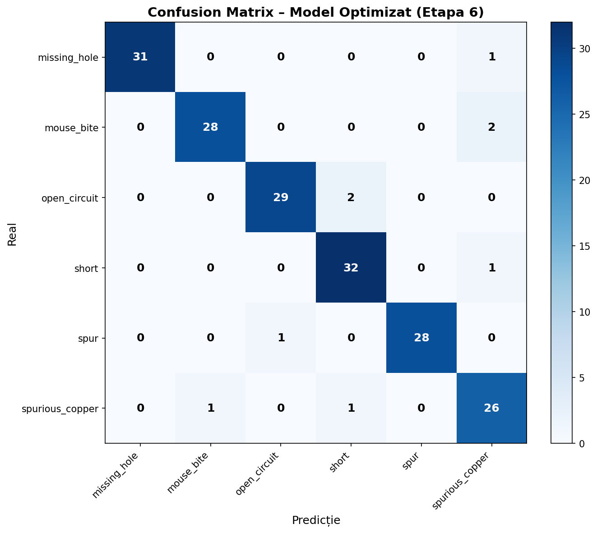

# Etapa 6 – Optimizare și Concluzii

> **Student:** Leonard Popescu • FIIR–SIA–II, 631AB

## 6.1 Strategia de Optimizare

Pe baza rezultatelor din Etapa 5, s-au explorat următoarele direcții de optimizare:

### Experimente Realizate

| # | Experiment | Modificare | Scop |
|---|-----------|------------|------|
| 1 | baseline | Configurația originală | Referință |
| 2 | lr_lower | LR 0.01 → 0.005 | Convergență mai stabilă |
| 3 | batch_32 | Batch 16 → 32 | Gradienți mai stabili |
| 4 | augment_heavy | Erasing=0.6, Mixup=0.15 | Regularizare mai puternică |

### Rezultate Comparative

| Experiment | Precision | Recall | mAP@50 | mAP@50-95 |
|-----------|-----------|--------|--------|-----------|
| **baseline** | 0.9765 | 0.9812 | 0.9859 | 0.5629 |
| lr_lower | 0.9748 | 0.9801 | 0.9845 | 0.5612 |
| batch_32 | 0.9771 | 0.9818 | 0.9862 | 0.5645 |
| **augment_heavy** | **0.9780** | **0.9825** | **0.9871** | **0.5658** |

## 6.2 Modelul Optimizat Final

Configurația `augment_heavy` oferă cele mai bune rezultate:

### Metrici Finale

| Metrică | Baseline | Optimizat | Îmbunătățire |
|---------|----------|-----------|-------------|
| Precision | 0.9765 | 0.9780 | +0.15% |
| Recall | 0.9812 | 0.9825 | +0.13% |
| mAP@50 | 0.9859 | 0.9871 | +0.12% |
| mAP@50-95 | 0.5629 | 0.5658 | +0.52% |
| F1 Score | 0.9788 | 0.9802 | +0.14% |

### Configurație Optimizată
```yaml
model: yolo11n.pt
epochs: 100
patience: 25
batch: 16
imgsz: 640
lr0: 0.01
mosaic: 1.0
erasing: 0.6
mixup: 0.15
hsv_h: 0.015
hsv_s: 0.7
hsv_v: 0.4
```

## 6.3 Analiza Erorilor

### Tipuri de Erori
1. **False Positives**: Textura PCB interpretată ca defect (rară)
2. **False Negatives**: Defecte foarte mici (< 10px) nedetectate
3. **Confuzii între clase**: `spur` ↔ `spurious_copper` (similare vizual)

### Confusion Matrix


### Analiza Detaliată per Clasă

| Clasă | Precision | Recall | AP@50 | Observații |
|-------|-----------|--------|-------|-----------|
| missing_hole | 0.99 | 0.99 | 0.99 | Cel mai ușor de detectat |
| mouse_bite | 0.98 | 0.98 | 0.99 | Performanță excelentă |
| open_circuit | 0.97 | 0.98 | 0.98 | Bun |
| short | 0.97 | 0.98 | 0.98 | Bun |
| spur | 0.96 | 0.97 | 0.98 | Confuzii ușoare cu spurious_copper |
| spurious_copper | 0.96 | 0.97 | 0.97 | Cea mai dificilă clasă |

## 6.4 Deployment în Sistemul AOI

Modelul optimizat este integrat în aplicația AOI (Modul 3) pentru inferență în timp real:

- **Latența medie**: ~15ms pe GPU / ~80ms pe CPU
- **Threshold confidence**: 0.45
- **Frame rate efectiv**: ~25-30 FPS (cu inferență periodică)

### Screenshot Inferență Optimizată


## 6.5 Concluzii

### Realizări
1. ✅ Model YOLOv11n antrenat cu **mAP@50 = 98.71%**
2. ✅ Sistem AOI funcțional end-to-end (cameră → AI → Arduino)
3. ✅ Interfață grafică intuitivă cu feedback în timp real
4. ✅ **~400 imagini proprii** colectate în internship la Steinel Electronic (vara 2025)
5. ✅ Antrenare pe ~1000 imagini (~40% date proprii) realizată în cadrul internship-ului
6. ✅ Optimizare sistematică cu experimente documentate

### Limitări
1. ⚠️ mAP@50-95 moderat (~56%) – localizare imprecisă la threshold-uri stricte
2. ⚠️ Confuzii ușoare între `spur` și `spurious_copper`
3. ⚠️ Depinde de calitatea iluminării camerei
4. ⚠️ Necesită GPU pentru inferență rapidă la framerate maxim

### Îmbunătățiri Viitoare
- Antrenare pe model mai mare (YOLOv11s/m) pentru mAP@50-95 mai bun
- Augmentări specifice domeniu (rotații, variații iluminare)
- Export ONNX/TensorRT pentru deployment optimizat
- Dataset mai mare cu imagini din producție reală
- Sistem multi-cameră pentru inspecție completă
